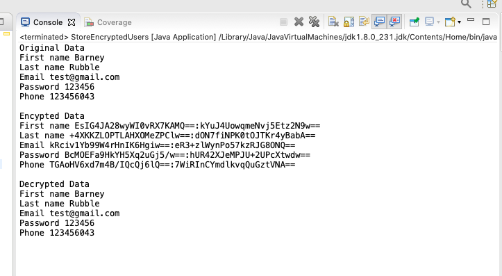

# Usage
> This code shows how to secure user's data by applying PBKDF2WithHmacSHA512 algorithm.

<!-- Contribution -->
[algorithm]: https://stackoverflow.com/questions/1132567/encrypt-password-in-configuration-files
